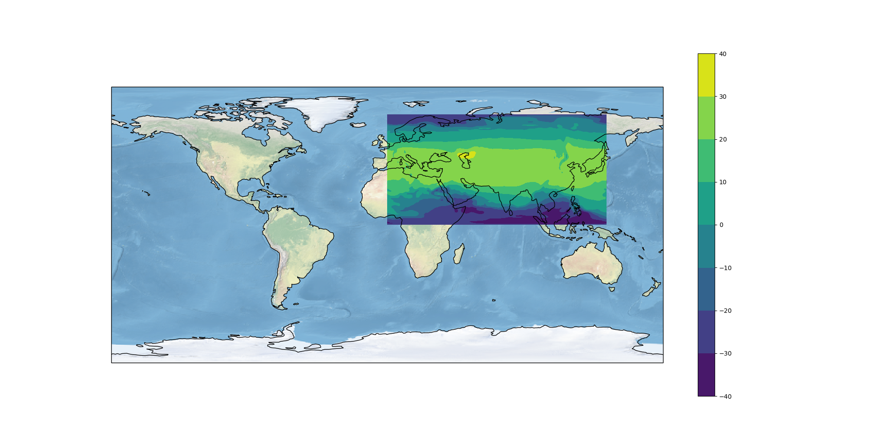

MyApp: a WPS template for CP4CDS
================================

.. image:: https://travis-ci.org/cp4cds/cp4cds-wps-template.svg?branch=master
   :target: https://travis-ci.org/cp4cds/cp4cds-wps-template
   :alt: Travis Build

MyApp is a minimal WPS to be used as a template to setup Web Processing Services (WPS)
in the CP4CDS Copernicus project.

Currently it is using the `PyWPS`_ WPS implementation.

Installation
************

The installation is done with `Buildout`_. It is using the Python distribution
system `Anaconda`_ to maintain software dependencies.

If Anaconda is not available then a minimal Anaconda will be installed during
the installation process in your home directory ``~/anaconda``.

The installation process setups a conda environment named ``myapp``. All
additional packages are going into this conda environment.
The location is ``~/.conda/envs/myapp``.

Now, check out the code from the GitHub repo as ``myapp`` and start the installation::

   $ git clone https://github.com/cp4cds/cp4cds-wps-template.git myapp
   $ cd myapp
   $ make clean install

After successful installation you need to start the services. All installed files (config etc ...)
are by default in your home directory ``~/birdhouse``. Now, start the services::

   $ make start  # starts supervisor services
   $ make status # shows supervisor status

The deployed WPS service is available on http://localhost:5000/wps?service=WPS&version=1.0.0&request=GetCapabilities.

Check the log files for errors::

   $ cd ~/birdhouse
   $ tail -f  var/log/pywps/myapp.log
   $ tail -f  var/log/supervisor/myapp.log

For other install options run ``make help`` and read the documention of the
`Makefile <http://birdhousebuilderbootstrap.readthedocs.org/en/latest/>`_.

Configuration
*************

If you want to run on a different hostname or port then change the default values in ``custom.cfg``::

   $ cd wps
   $ vim custom.cfg
   $ cat custom.cfg
   [settings]
   hostname = localhost
   http-port = 5000

After any change to your ``custom.cfg`` you **need** to run ``make update`` (offline mode) or ``make install`` again
and restart the ``supervisor`` service::

  $ make install
  $ make restart
  $ make status

Running WPS service in test environment
***************************************

For development purposes you can run the WPS service without nginx and supervisor.
Use the following instructions::

  # get the source code
  $ git clone https://github.com/cp4cds/cp4cds-wps-template.git myapp
  $ cd myapp

  # create conda environment
  $ conda env create -f environment.yml

  # activate conda environment
  $ source activate myapp

  # install myapp code into conda environment
  $ python setup.py develop

  # start the WPS service
  $ myapp

  # open your browser on the default service url
  $ firefox http://localhost:5000/wps

  # ... and service capabilities url
  $ firefox http://localhost:5000/wps?service=WPS&request=GetCapabilities

Using Docker
************

Get docker images using docker-compose::

    $ docker-compose pull

Start the demo with docker-compose::

    $ docker-compose up -d  # runs with -d in the background
    $ docker-compose logs -f  # check the logs if running in background

By default the WPS service should be available on port 5000::

    $ firefox "http://localhost:5000/wps?service=wps&request=GetCapabilities"

Alternatively you can change the port by using environment variables, for example::

    $ HTTP_PORT=8097 docker-compose up -d # wps service will be available on port 8097

Run docker exec to watch logs::

    $ docker ps     # find container name
    myapp_myapp_1
    $ docker exec myapp_myapp_1 tail -f /opt/birdhouse/var/log/supervisor/myapp.log
    $ docker exec myapp_myapp_1 tail -f /opt/birdhouse/var/log/pywps/myapp.log

Use docker-compose to stop the containers::

    $ docker-compose down

Example run with Birdy
**********************

To have some more convenience you can use the birdy WPS commandline client.

Install it via the conda package manager::

  $ conda install -c birdhouse -c conda-forge birdhouse-birdy

Configure the WPS service::

  $ export WPS_SERVICE=http://localhost:5000/wps

Now, run the birdy on the ``say_hello`` process::

  $ birdy -h
  $ birdy say_hello -h
  $ birdy say_hello --name Birdy
  [ProcessAccepted 0/100] PyWPS Process say_hello accepted
  [ProcessSucceeded 0/100] PyWPS Process Process Say Hello finished
  Output:
  output=Hello Birdy

Generate a simple plot for a netCDF file from a public thredds server::

  $ birdy simple_plot -h
  $ birdy simple_plot \
    --variable air \
    --dataset https://www.esrl.noaa.gov/psd/thredds/fileServer/Datasets/ncep.reanalysis/surface/air.sig995.2012.nc
 [ProcessAccepted 0/100] PyWPS Process simple_plot accepted
 [ProcessSucceeded 0/100] PyWPS Process Simple Plot finished
 Output:
 output=http://localhost:8090/wpsoutputs/myapp/17031194-9d2d-11e7-9809-68f72837e1b4/plot.png (image/png)

.. _Copernicus: http://climate.copernicus.eu/
.. _PyWPS: http://pywps.org/
.. _Buildout: http://www.buildout.org/
.. _Anaconda: http://www.continuum.io/
